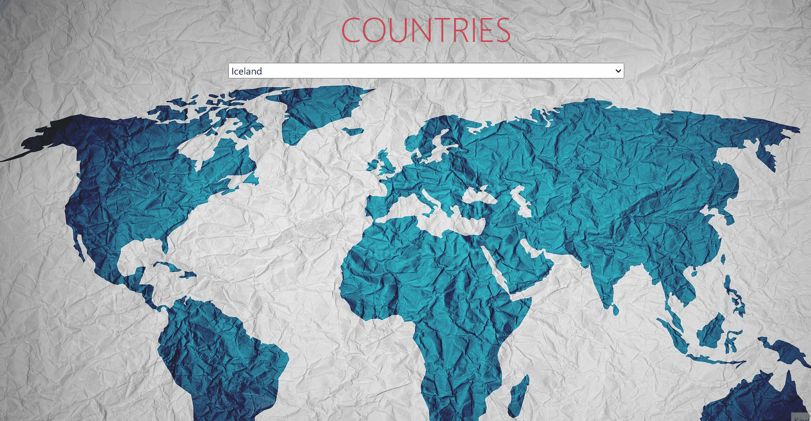

# countries_flag

## Description
Our goal in this project is to create countries information page using JavaScript and APIs.

## Outcome

## Objective

-  User stories;

    -   After selecting the country name, some information about that country will be displayed on the page screen.
    
    -   This informations :flag, continent, capital, languages, currency unit

<button><a href="https://muratbzc.github.io/countries_flag/">Go To Web Site</a></button>
